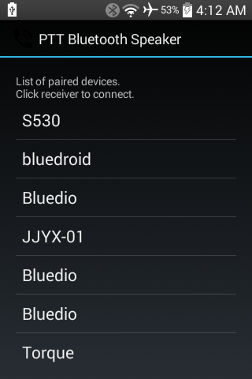
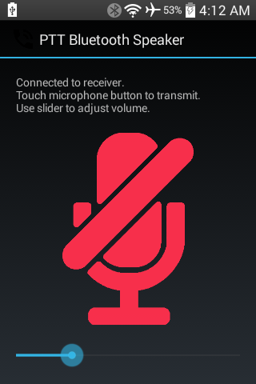
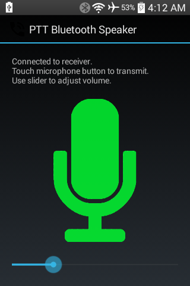

#### [Android PTT Bluetooth Speaker](https://github.com/warren-bank/Android-PTT-Bluetooth-Speaker)

Pair of Android apps:

1. sender
   - captures audio from the microphone and sends it to the receiver
2. receiver
   - receives audio from the sender and plays it through the speaker

#### Background:

* there are many other apps that use bluetooth to enable two-way communication between users
  - [WalkieTalkie](https://github.com/gms298/Android-Walkie-Talkie) is an excellent example because its mechanics are very similar under the hood
* the use-case I had in mind is a little unusual..
  - communication needs to be one-way
  - on the receiver side, the app should run as a server within a foreground Service
    * there is no visible UI
    * make bluetooth adapter discoverable
    * start a bluetooth socket server
    * listen for a connection from a sender
      - when a sender connects:
        * stop listening for a sender connection
        * read audio stream from connected socket
        * play audio
      - when a sender disconnects:
        * resume listening for a new sender connection
  - on the sender side, the app should run as a client within an Activity
    * display a list of all paired devices
      - click the one that identifies the desired receiver
      - wait for connection
    * touch a PTT toggle button in the UI to stream audio from the microphone through the connected socket
      - touch the PTT toggle button again to temporarily interrupt the audio stream
    * move a slider to adjust the volume of the audio stream
      - the receiver plays the audio stream at its maximum volume
      - the sender can apply a gain factor to change the loudness of the microphone's normal volume before it is sent through the socket
        * the default gain is 25%
        * the maximum gain is 200%

#### Notes:

* receiver:
  - bluetooth adapter is only discoverable for 60 seconds after the service is started
    * Android displays a prompt to ask for permission to do so
    * if the intended sender has already been paired, then this step isn't necessary
      - there's no harm to decline Android's prompt
* sender:
  - if not already paired to the receiver
    * can become paired during the 60 seconds that the receiver is discoverable
  - after a persistent pairing is established to the receiver
    * can (re)connect at any time

#### Misc:

* _PTT_ is short for: _Push To Talk_
  - which is a term that describes how the button on a Walkie-Talkie is used:
    * push to broadcast
    * release to listen
  - the sender was originally designed to follow this usage pattern
    * which explains why this term is included in the name of the app
    * however, I subsequently chose that a toggle button would be easier to use

#### Screenshots

#### Legal:

* copyright: [Warren Bank](https://github.com/warren-bank)
* license: [GPL-2.0](https://www.gnu.org/licenses/old-licenses/gpl-2.0.txt)
